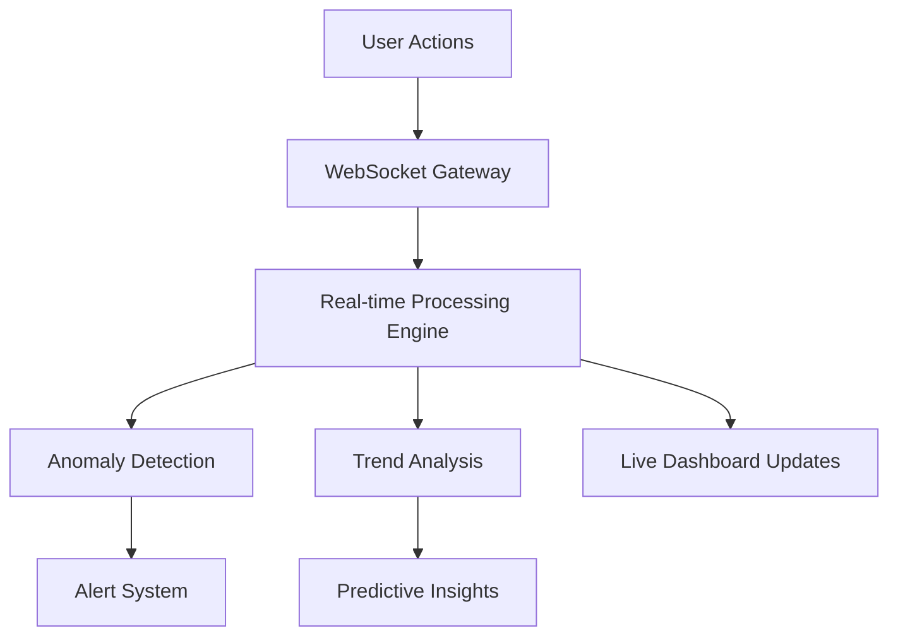
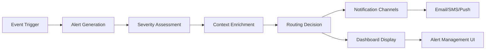
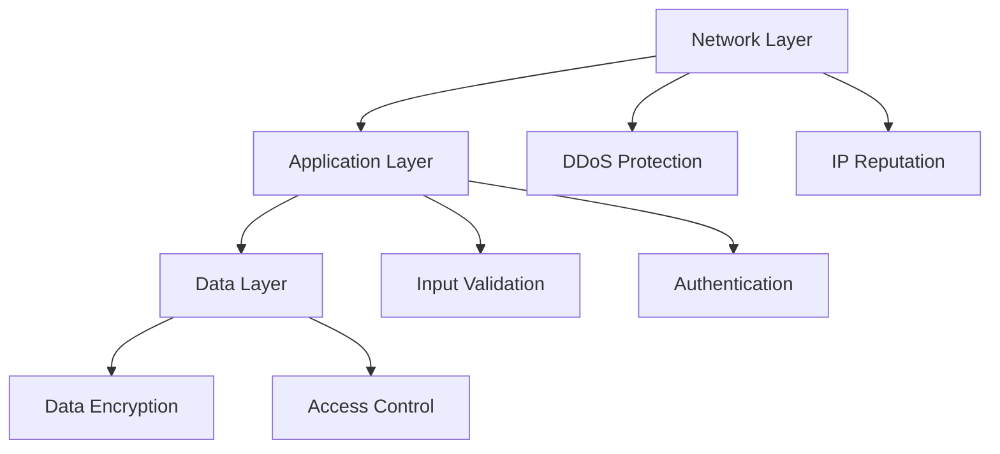
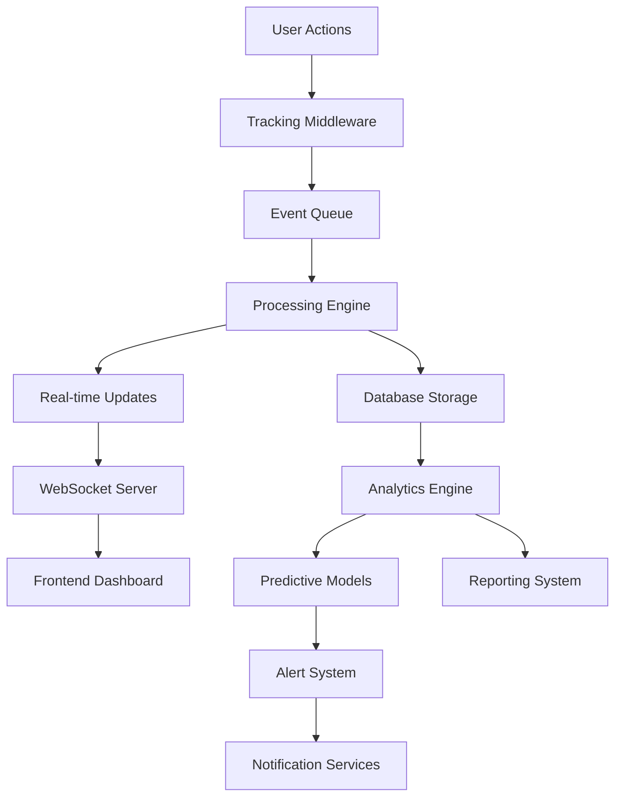

# Comprehensive Tracking System Design

## Overview

This document outlines the design for an enhanced, comprehensive tracking system that builds upon the existing foundation while adding advanced features for real-time monitoring, data accuracy, user-friendly dashboards, automated alerts, predictive analytics, seamless integration, and robust security.

## Current System Analysis

### Strengths
- **Modular Architecture**: Separate components for service, middleware, models, and API
- **Security Focus**: Input validation, rate limiting, SQL/XSS detection, brute force protection
- **Performance Optimization**: Caching, batch processing, lazy model loading
- **Comprehensive Tracking**: Multiple categories (file operations, user actions, system access, performance)
- **Real-time Capabilities**: WebSocket integration for live updates
- **Admin Interface**: Django admin integration with granular permissions

### Areas for Enhancement
- **Real-time Monitoring**: Expand beyond basic metrics to include predictive insights
- **Data Accuracy**: Add validation, reconciliation, and anomaly detection
- **User Experience**: Enhance dashboard usability and customization
- **Automation**: Implement intelligent alerting with ML-based prioritization
- **Predictive Analytics**: Add forecasting and trend analysis
- **Integration**: Ensure seamless workflow integration with existing systems
- **Security**: Enhance with advanced threat detection and response

## Enhanced Architecture Design

### 1. Real-time Monitoring System

#### Components:
- **Enhanced WebSocket Server**: Upgrade to handle more concurrent connections with message prioritization
- **Real-time Data Pipeline**: Kafka/RabbitMQ for high-throughput event processing
- **Live Metrics Engine**: In-memory processing with Redis for sub-second updates
- **Session Tracking**: Enhanced user session monitoring with behavioral analysis

#### New Features:


### 2. Data Accuracy Framework

#### Components:
- **Data Validation Layer**: Schema validation, type checking, range verification
- **Data Reconciliation Engine**: Cross-system data consistency checks
- **Anomaly Detection**: ML-based outlier detection for tracking data
- **Data Quality Dashboard**: Visual representation of data health metrics

#### Implementation:
```python
class DataAccuracyService:
    def validate_event(self, event_data):
        # Schema validation
        # Type checking
        # Range verification
        # Cross-field consistency checks

    def reconcile_data(self, source_data, target_data):
        # Cross-system consistency verification
        # Conflict resolution
        # Data synchronization

    def detect_anomalies(self, historical_data, current_data):
        # Statistical analysis
        # ML-based anomaly detection
        # Pattern recognition
```

### 3. User-friendly Dashboard System

#### Components:
- **Customizable Layouts**: Drag-and-drop widget arrangement
- **Role-based Views**: Tailored dashboards for different user roles
- **Widget Library**: Pre-built and customizable visualization components
- **Personalization Engine**: User preference-based dashboard configuration

#### Dashboard Structure:
```
Monitoring Dashboard
├── Header (Connection status, controls)
├── Alerts Section (Priority-based display)
├── Main Content Area
│   ├── Real-time Overview
│   ├── System Health
│   ├── User Analytics
│   ├── Database Performance
│   └── Error Tracking
└── Navigation Tabs (Overview, Real-time, Users, System, Database, Segments, Errors)
```

### 4. Automated Alerts System

#### Components:
- **Intelligent Alert Engine**: ML-based alert prioritization
- **Alert Routing**: Role-based alert distribution
- **Escalation Policies**: Time-based and severity-based escalation
- **Alert Deduplication**: Prevent alert fatigue
- **Alert Contextualization**: Rich context for faster resolution

#### Alert Workflow:


### 5. Predictive Analytics Engine

#### Components:
- **Time Series Forecasting**: Predict future metrics based on historical data
- **Trend Analysis**: Identify emerging patterns and correlations
- **Churn Prediction**: Anticipate user disengagement
- **Performance Forecasting**: Predict system resource requirements

#### ML Models:
```python
class PredictiveAnalytics:
    def forecast_metrics(self, historical_data, forecast_period):
        # ARIMA/SARIMA models
        # Prophet forecasting
        # LSTM neural networks

    def detect_trends(self, time_series_data):
        # Trend detection algorithms
        # Seasonality analysis
        # Change point detection

    def predict_churn(self, user_behavior_data):
        # Classification models
        # Feature importance analysis
        # Risk scoring
```

### 6. Integration Framework

#### Components:
- **API Gateway**: Unified interface for all tracking services
- **Event Bus**: Pub/Sub system for cross-service communication
- **Webhook System**: Real-time notifications to external systems
- **Data Export/Import**: Standardized formats for interoperability

#### Integration Points:
```
Existing Workflows
├── Order Processing --> Tracking Events
├── User Authentication --> Security Monitoring
├── Product Management --> Change Tracking
├── Payment Processing --> Transaction Monitoring
└── Customer Support --> Interaction Tracking
```

### 7. Security Enhancement Framework

#### Components:
- **Advanced Threat Detection**: Behavioral analysis and anomaly detection
- **Security Audit Trail**: Comprehensive logging of all security events
- **Automated Response**: Predefined actions for common threats
- **Security Dashboard**: Centralized view of security posture

#### Security Layers:


## Implementation Roadmap

### Phase 1: Foundation Enhancement (2-3 weeks)
- Upgrade WebSocket server for better performance
- Implement data validation and reconciliation
- Enhance existing dashboard components
- Add basic alert prioritization

### Phase 2: Advanced Features (3-4 weeks)
- Implement predictive analytics models
- Develop customizable dashboard system
- Add intelligent alert routing
- Integrate with existing workflows

### Phase 3: Optimization & Security (2 weeks)
- Performance tuning and scaling
- Advanced security features
- Comprehensive testing
- Documentation and training

## Technical Stack

### Backend:
- **Primary**: Django, Django REST Framework
- **Real-time**: Django Channels, WebSocket
- **Data Processing**: Celery, Redis
- **ML/AI**: scikit-learn, TensorFlow, PyTorch
- **Database**: PostgreSQL, Redis

### Frontend:
- **Framework**: React.js
- **State Management**: Redux, Context API
- **Visualization**: Chart.js, D3.js, Recharts
- **UI Components**: Material-UI, Custom Components

### Infrastructure:
- **Containerization**: Docker
- **Orchestration**: Kubernetes
- **Monitoring**: Prometheus, Grafana
- **Logging**: ELK Stack (Elasticsearch, Logstash, Kibana)

## Data Flow Architecture



## Monitoring and Maintenance

### Key Metrics:
- System uptime and availability
- Data processing latency
- Alert response times
- Dashboard load times
- API response times
- Data accuracy metrics

### Maintenance Procedures:
- Regular data quality audits
- Performance benchmarking
- Security vulnerability scanning
- Backup and disaster recovery testing
- User feedback collection and analysis

## Success Criteria

1. **Real-time Monitoring**: Sub-second updates for critical metrics
2. **Data Accuracy**: 99.9% data consistency across systems
3. **User Experience**: 90%+ user satisfaction with dashboard usability
4. **Alert Effectiveness**: 80%+ reduction in false positives
5. **Predictive Accuracy**: 85%+ accuracy in key predictions
6. **Integration Success**: 100% compatibility with existing workflows
7. **Security**: Zero critical vulnerabilities in production

This comprehensive design builds upon the existing tracking system foundation while adding the advanced features requested, ensuring a robust, scalable, and user-friendly monitoring solution.